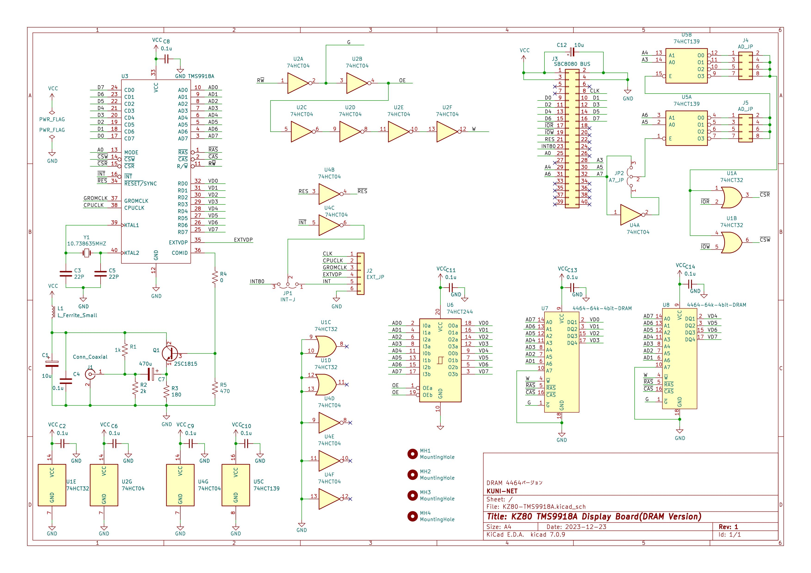

== KZ80シリーズ TMS9918A ビデオボード(DRAM版)

=== 概要
* SBC8080バスにつながるTMS9918Aビデオボードのプロジェクトです。
* 本ボードの詳しい説明は以下のwikiページをご覧ください。
** https://github.com/kuninet/KZ80-TMS9918A/wiki
* 以下のリポジトリからFORKしたかたちで、SRAM版からDRAM版へ変更したリポジトリです。
** https://github.com/kuninet/KZ80-TMS9918A

=== ライセンス
* 本プロジェクトのデータはMITライセンスのもとで公開します。

=== 参考
* 以下のサイトの情報を参考に作成しています。ありがとうございます。
** https://github.com/jblang/TMS9918A
** https://retrobrewcomputers.org/n8vem-pbwiki-archive/0/35845334/48860720/33053543/SRAM%20Replacement%20for%20TMS99x8%20VRAM.pdf
