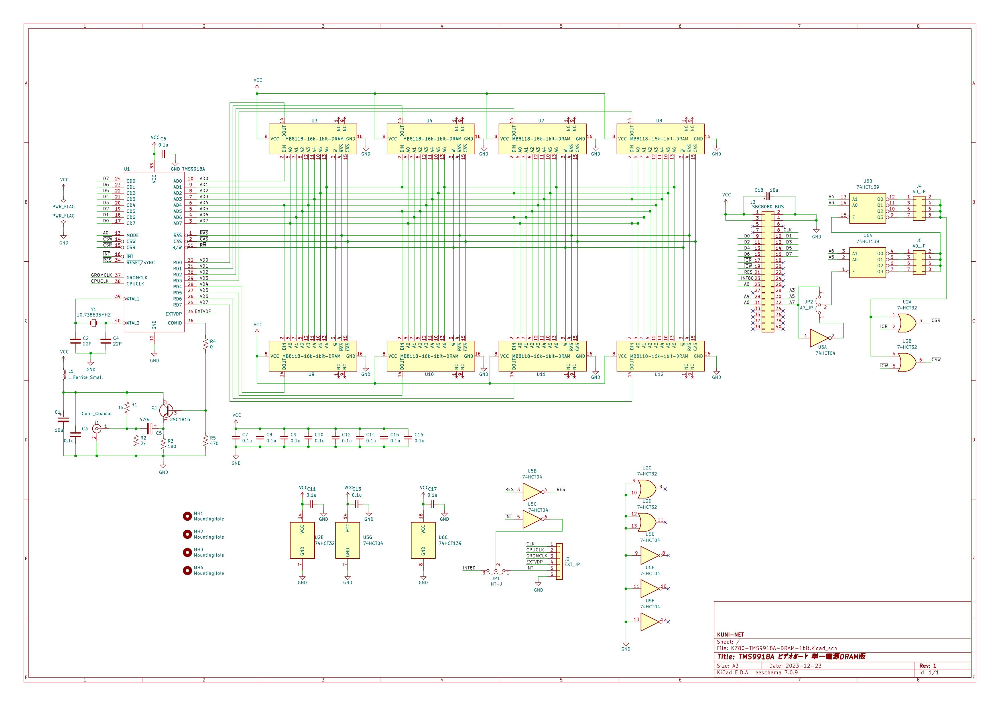

# KZ80シリーズ TMS9918A ビデオボード(DRAM版)

## 本基板は試作中です。ご注意ください。

## 概要

* SBC8080バスにつながるTMS9918Aビデオボードのプロジェクトです。
* 以下のリポジトリからFORKしたかたちで、SRAM版からDRAM版へ変更したリポジトリです。
  * https://github.com/kuninet/KZ80-TMS9918A

### 4464 64kbit x 4bit DRAM版

### MB8118 16kbit x 1bit DRAM版

## ライセンス
* 本プロジェクトのデータはMITライセンスのもとで公開します。

## 参考
* 以下のサイトの情報を参考に作成しています。ありがとうございます。
  * https://digicoolthings.com/tms9929a-vdp-rediscovery-and-alternative-vram-solution/
