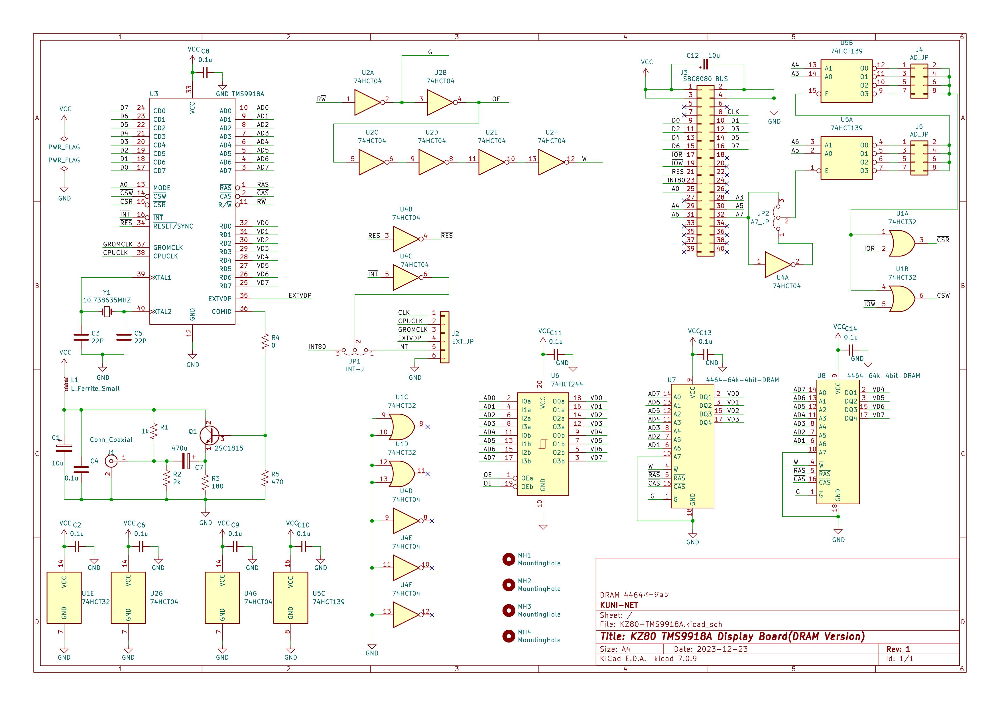

# KZ80シリーズ TMS9918A ビデオボード(DRAM版)

## 概要

* SBC8080バスにつながるTMS9918Aビデオボードのプロジェクトです。
* 以下のリポジトリからFORKしたかたちで、SRAM版からDRAM版へ変更したリポジトリです。
  * https://github.com/kuninet/KZ80-TMS9918A

### 4464 64kbit x 4bit DRAM版

#### 回路図

#### 部品表

[KiCAD/KZ80-TMS9918A.csv](KiCAD/KZ80-TMS9918A.csv)

### MB8118 16kbit x 1bit DRAM版

#### 回路図

#### 部品表

[KiCAD-1bit/KZ80-TMS9918A-DRAM-1bit.csv](KiCAD-1bit/KZ80-TMS9918A-DRAM-1bit.csv)

## ライセンス
* 本プロジェクトのデータはMITライセンスのもとで公開します。

## 参考
* 64k x 4bit版は、以下のサイトの情報を参考に作成しています。ありがとうございます。
  * https://digicoolthings.com/tms9929a-vdp-rediscovery-and-alternative-vram-solution/
