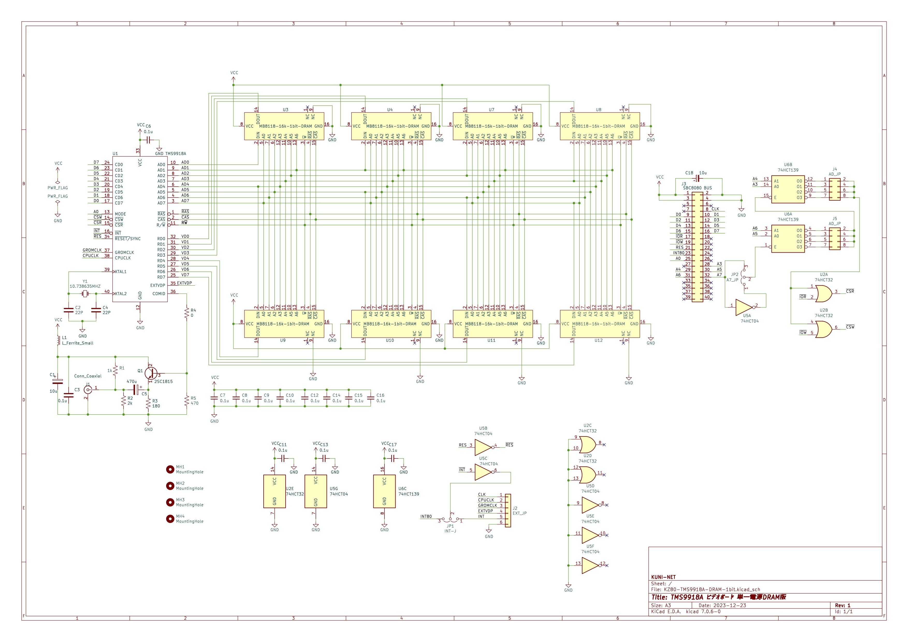

# KZ80シリーズ TMS9918A ビデオボード(DRAM版)

## 概要

* SBC8080バスにつながるTMS9918Aビデオボードのプロジェクトです。
* 以下のリポジトリからFORKしたかたちで、SRAM版からDRAM版へ変更したリポジトリです。
  * https://github.com/kuninet/KZ80-TMS9918A

### 4464 64kbit x 4bit DRAM版

#### 回路図

#### 部品表

[KiCAD/KZ80-TMS9918A.csv](KiCAD/KZ80-TMS9918A.csv)

### MB8118 16kbit x 1bit DRAM版

#### 回路図

#### 部品表

[KiCAD-1bit/KZ80-TMS9918A-DRAM-1bit.csv](KiCAD-1bit/KZ80-TMS9918A-DRAM-1bit.csv)

## ジャンパ設定

* I/Oアドレスをジャンパ設定で変更できます。
  * JP2、J5、J4の設定値を加算したものがI/Oアドレスとなります。

### ☆★ プリント基板のバージョンによってはシルク印刷が正しくないものがありますので、回路図と見比べてください。☆★

### JP2:アドレス線A7ジャンパ

|端子|設定|
|:--|:--|
|1-2|$80|
|2-3|$00|

### J5:アドレス線A6,A5ジャンパ

|端子|設定|
|:--|:--|
|1-2|$00|
|3-4|$20|
|5-6|$40|
|7-8|$60|

### J4:アドレス線A4,A3ジャンパ

|端子|設定|
|:--|:--|
|1-2|$00|
|3-4|$08|
|5-6|$10|
|7-8|$18|

## ライセンス
* 本プロジェクトのデータはMITライセンスのもとで公開します。

## 参考
* 64k x 4bit版は、以下のサイトの情報を参考に作成しています。ありがとうございます。
  * https://digicoolthings.com/tms9929a-vdp-rediscovery-and-alternative-vram-solution/
